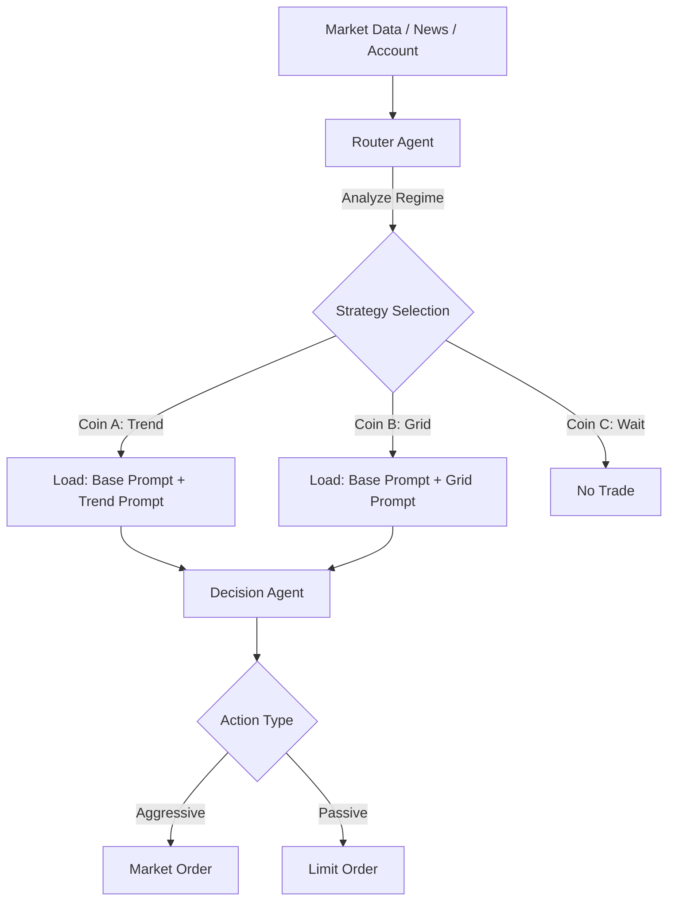

# 策略路由与限价单系统设计文档 (Strategy Routing & Limit Order System Design)

**版本**: v1.0  
**日期**: 2024-05-20  
**状态**: 提案 (Proposal)

---

## 1. 概述 (Overview)

本设计文档旨在对现有的 `nofx-rl` 交易系统进行架构升级，引入 **"策略路由 (Strategy Routing)"** 机制与 **"限价单 (Limit Order)"** 支持。

### 核心目标
1.  **决策分层**：将复杂的单体 Prompt 拆分为“基础风控层”与“特定策略层”。
2.  **动态路由**：引入路由 Agent，根据市场状态（趋势、震荡、突破）为每个币种动态匹配最佳交易策略。
3.  **执行优化**：支持限价挂单（Limit Maker/Post Only），降低滑点成本，适应不同策略需求（如网格交易）。
4.  **Token 优化**：通过“惰性路由”机制，减少不必要的全量策略分析，降低 LLM 开销。

### 2.3 惰性路由机制 (Lazy Routing Mechanism)

**设计原则**:
由于市场状态（Market Regime）通常具有持续性（例如一个上涨趋势可能持续数天），每一分钟都调用 LLM 进行“策略重路由”是巨大的资源浪费。因此，我们引入 **“惰性路由 (Lazy Routing)”**。

*   **基本概念**: 只有在特定条件触发时，才重新请求 Router Agent 更新策略；否则，沿用缓存中的策略标签。
*   **触发条件 (Trigger Conditions)**:
    1.  **时间触发**: 默认 TTL (Time-To-Live) 为 4 小时。超过 4 小时强制重路由。
    2.  **波动率触发**: 当 BTC 1小时内涨跌幅超过 2%（大盘剧变）。
    3.  **事件触发 (Low Priority)**: 收到“重大新闻”信号（需接入 News Feed）。
        *   *机制*: News Watcher 获取新闻 -> **News Catalyst Agent (LLM)** 进行语义评分 (1-10) -> 若 Score > 8，则触发全局重路由。
        *   *注意*: 初期可暂不实现，或仅基于硬规则（如 CPI 公布时间点）触发。
    4.  **连续亏损触发**: 当前策略连续 N 笔交易亏损，强制重新评估。
    5.  **连续观望触发 (Consecutive Wait)**: 当前策略连续 M 次（如 12 次，即 1 小时）决策均为 `wait`，提示当前策略可能不适配市场，强制重新评估。
*   **持久化**: 路由结果应存储在内存或 Redis 中，结构为 `Map<Symbol, {StrategyCode, UpdateTime, Reason}>`。

---

## 2. 架构设计 (Architecture)

### 2.1 现有流程 vs 新流程

**现有流程 (Current):**
`Market Data` -> `Decision Agent (Huge Prompt)` -> `Action (Market Order)`

**新流程 (New):**



### 2.2 提示词工程架构 (Prompt Engineering)

将原有的 `adaptive_moderate_hist_v6_3.txt` 拆分为模块化组件：

#### A. 基础指令 (`prompts/base/instruction.txt`)
*   **全局风控**：仓位上限、杠杆限制、最大持仓数。
*   **基础行为**：JSON 输出格式、错误处理。
*   **资金管理**：单笔风险 %、止损硬性距离。
*   **禁止事项**：反向持仓、过度加仓。

#### B. 策略库 (`prompts/strategies/`)
所有策略文件存放在此目录，每个文件只关注特定的入场/出场逻辑。

1.  **`trend_carry.txt` (趋势跟随)**
    *   **场景**：趋势早/中期，ADX 高，均线发散。
    *   **行为**：持有为主，追踪止损（Trailing Stop），金字塔加仓（可选）。
    *   **订单类型**：Market (追突破) 或 Limit (浅回调)。
2.  **`pullback_ema.txt` (均线回抽)**
    *   **场景**：强趋势中的深度回调。
    *   **行为**：在 EMA20/50/Vegas 通道附近挂单。
    *   **订单类型**：Limit (必须是挂单)。
3.  **`breakout_volexp.txt` (放量突破)**
    *   **场景**：布林带收口后，伴随成交量剧增。
    *   **行为**：右侧交易，突破关键位进场。
    *   **订单类型**：Stop-Market (触发单) 或 Market。
4.  **`range_grid.txt` (震荡网格)**
    *   **场景**：ADX 低，价格在区间内波动。
    *   **行为**：区间下沿 Limit Buy，上沿 Limit Sell。小仓位，高频。
    *   **订单类型**：Limit Only。
5.  **`no_trade.txt` (观望)**
    *   **场景**：趋势晚期、重大事件前夕、流动性枯竭。
    *   **行为**：强制 Wait。

#### C. 路由指令 (`prompts/router_agent.txt`)
*   **输入**：Top 20 币种技术指标（RSI, Bollinger Width, ADX, Volume, Funding Rate）、宏观新闻摘要。
*   **输出**：JSON Map `{ "BTC": "trend_carry", "ETH": "no_trade", "SOL": "range_grid" }`。

---

## 3. 详细功能规范 (Functional Specifications)

### 2.2 执行流程详解 (Execution Flow)

**关键点：按策略分组并行执行 (Group by Strategy & Parallel Execution)**

由于不同策略需要加载不同的 System Prompt（例如“趋势策略”强调突破，“网格策略”强调回调），我们不能在一个 LLM 请求中混合处理不同策略的币种。因此，后端必须进行**分组调度**。

1.  **路由阶段 (Routing)**:
    *   输入：20 个候选币种的市场数据。
    *   输出：映射表 `Map<Symbol, StrategyCode>`
        ```json
        { "BTC": "trend_carry", "ETH": "trend_carry", "SOL": "range_grid", "DOGE": "no_trade" }
        ```

2.  **分组阶段 (Grouping)**:
    *   系统将币种按策略代码分组：
        *   **Group A (trend_carry)**: [BTC, ETH]
        *   **Group B (range_grid)**: [SOL]
        *   **Group C (no_trade)**: [DOGE] -> 直接过滤，不消耗 Token。

3.  **并行决策 (Parallel Decision)**:
    *   **Thread 1**: 加载 `trend_carry.txt`，处理 Group A (BTC, ETH)。
    *   **Thread 2**: 加载 `range_grid.txt`，处理 Group B (SOL)。
    *   *Thread 3*: (Group C 被跳过)。

4.  **结果聚合 (Aggregation)**:
    *   收集 Thread 1 和 Thread 2 的决策结果，合并即为最终的交易指令列表。

---

## 3. 详细功能规范 (Functional Specifications)

*   **职责**：不进行具体交易决策，只定“基调”。
*   **输入数据**：
    *   多周期 K 线形态摘要。
    *   波动率指标 (ATR, Bollinger Band Width)。
    *   趋势强度 (ADX)。
    *   新闻情绪分数。
*   **输出结构**：
    ```json
    {
      "analysis_timestamp": 1716192000,
      "global_regime": "bullish_trend", // bullish_trend, bearish_trend, range, high_volatility
      "strategies": {
        "BTCUSDT": {
          "code": "trend_carry",
          "reason": "4H ADX > 30, Price > EMA20, no resistance overhead"
        },
        "ETHUSDT": {
          "code": "range_grid",
          "reason": "Bollinger Squeeze, RSI oscillating 40-60"
        }
      }
    }
    ```
*   **优化（惰性更新 / Lazy Routing）**：
    *   **机制**：Router 不必每次 K 线更新都运行。
    *   **触发条件**：
        1.  **定时触发**：每 30 分钟或 1 小时运行一次。
        2.  **决策 Agent 反馈**：当 Decision Agent 发现当前策略 `code` 连续 3 次 `wait` 或亏损时，在输出中标记 `"request_reroute": true`，强制立即触发 Router 更新该币种策略。
        3.  **波动率警报**：BTC 5分钟内波动 > 1% 时，触发全量重新路由。

### 3.2 限价单支持 (Limit Order Support)

目前系统仅支持市价单 (Market Order)，无法满足 `pullback_ema` 和 `range_grid` 策略需求。

#### 变更点：
1.  **后端 API (`trader/`)**：
    *   `ExecuteOrder` 接口需增加 `OrderType` (MARKET, LIMIT) 和 `Price` 参数。
    *   增加 `TimeInForce` 参数 (GTC, IOC, FOK)。建议默认为 `GTC` (Good Till Cancel)。
    *   增加 `PostOnly` (只做 Maker) 选项，节省手续费。
2.  **LLM 输出协议**：
    *   在 JSON Action 中增加 `order_type` 和 `limit_price` 字段。
    *   **示例**：
        ```json
        {
          "action": "open_long",
          "symbol": "BTCUSDT",
          "order_type": "limit",
          "limit_price": 65200.50,
          "quantity": 0.1,
          "reasoning": "Trend pullback to EMA20 support."
        }
        ```
3.  **订单管理**：
    *   需要一个轮询服务或 WebSocket 监听，监控“挂单 (Open Orders)”的状态。
    *   **超时取消**：如果限价单在 N 分钟内未成交，Decision Agent 需决定是“撤单”还是“追单(改为市价)”。

### 3.3 前端调整 (Frontend Adjustments)

#### 交易员展示界面
需要清晰区分“已成交持仓”和“未成交挂单”。

1.  **持仓列表 (Positions)**：
    *   展示当前持有的合约、未实现盈亏、杠杆等（维持现状）。
2.  **挂单列表 (Open Orders)**：
    *   **新增 Tab**。
    *   展示：币种、方向、挂单价格、现价、挂单时间、策略来源。
    *   操作：允许人工“撤单 (Cancel)”。
3.  **LLM 决策面板 (Decision Dashboard)**：
    *   **布局变更**：从“按币种平铺”改为**“按策略分组堆叠”**。
    *   **策略组卡片 (Strategy Group Card)**：
        *   对应后端的一次分组调用（即一个 Group）。
        *   **Header (路由层)**：
            *   显示策略名称（如 `Trend Carry`）和图标。
            *   显示 Router Agent 对该组的**共性分析**（为何这些币种适合此策略）。
        *   **Body (决策列表)**：
            *   列表展示该组下的具体币种决策。
            *   **Item**: 币种 (BTC) | 操作 (Open Long) | 价格 | 专属理由 (Reasoning)。
    *   **示例结构**：
        ```text
        ┌───────────────────────────────────────────────────────────────┐
        │  � 策略组：趋势跟随 (Trend Carry)                            │
        │  路由分析：大盘突破日线阻力，Funding Rate 正常，适合趋势操作。  │
        ├───────────────────────────────────────────────────────────────┤
        │  🔹 BTC   |  MARKET BUY  |  $67,000  | 突破三角收敛，量能配合 │
        │  🔹 ETH   |  WAIT        |     -     | 虽有趋势但受阻于均线   │
        └───────────────────────────────────────────────────────────────┘

        ┌───────────────────────────────────────────────────────────────┐
        │  � 策略组：震荡网格 (Range Grid)                             │
        │  路由分析：波动率收窄，ADX < 20，适合区间套利。                │
        ├───────────────────────────────────────────────────────────────┤
        │  🔸 SOL   |  LIMIT BUY   |  $142.50  | 挂单于布林下轨支撑位   │
        │  🔸 AVAX  |  LIMIT SELL  |  $35.80   | 挂单于前期高点压力位   │
        └───────────────────────────────────────────────────────────────┘
        ```

---

## 4. 实施步骤 (Implementation Plan)

### 第一阶段：文件结构重构 (Refactoring)
1.  创建 `prompts/base/` 和 `prompts/strategies/` 文件夹。
2.  将 `adaptive_moderate_hist_v6_3.txt` 拆解。
3.  编写 `prompts/router_agent.txt`。

### 第二阶段：后端限价单改造 (Backend Upgrade)
1.  修改 `Order` 结构体，支持 `Type` 和 `Price`。
2.  升级交易所 Client (Binance/Okx) 接口，对接 Limit Order API。
3.  实现“挂单同步”逻辑 (Sync Open Orders)。

### 第三阶段：路由 Agent 开发 (Router Implementation)
1.  开发 `RouterService`，按定时/事件触发。
2.  实现 Prompt 动态拼装逻辑：`Final_Prompt = Base + Strategy[Code] + Market_Data`。

### 第四阶段：前端适配 (Frontend Update)
1.  更新 API 数据结构，返回 Open Orders。
2.  修改 React 组件，增加挂单展示栏。
3.  优化决策日志展示。

---

## 5. 风险评估 (Risk Assessment)

1.  **挂单无法成交**：`pullback` 策略可能永远接不到货，导致踏空。
    *   *对策*：策略中需包含“若价格远离挂单 > X%，自动撤单”的逻辑。
2.  **路由抖动**：Router 在 `trend` 和 `range` 之间频繁跳变。
    *   *对策*：引入“最小保持时间 (Hysteresis)”，策略一旦选定，至少维持 4 小时，除非遇到极端行情。
3.  **复杂性增加**：系统状态变多（持仓 vs 挂单）。
    *   *对策*：在初期测试阶段，仅对 1-2 个币种开启路由模式，其余保持 `no_trade` 或旧模式。

